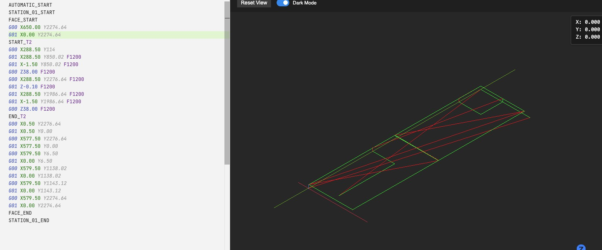

# NC Viewer

A Visual Studio Code extension for viewing NC/G-code files with interactive 3D visualization.

## Features

- ✨ **Integrated Preview** - Open a 3D preview of your G-code directly in the editor.
- 🚀 **Quick Access** - Launch the viewer with a dedicated icon in the editor title bar or with a keyboard shortcut.
- ⌨️ **Keyboard Shortcut** - Use `Ctrl+K V` to open the preview, just like with Markdown files.
- 🎯 **Offline & Secure** - Works without an internet connection and opens files directly from your workspace. No file uploads.
- 🎨 **3D Path Visualization** - Interactive Three.js rendering of toolpaths.
- 🌙 **Dark/Light Themes** - Automatically matches your VS Code theme.
- 📊 **Real-time Position Tracking** - See current X/Y/Z coordinates as you scrub through the timeline.

## Usage

1. Open any `.nc`, `.gcode`, or `.cnc` file in VS Code.
2. Click the "Open Preview" icon in the editor title bar (top-right).
3. Alternatively, use the keyboard shortcut `Ctrl+K V`.
4. View your toolpath in 3D!

## Installation

Install from the VS Code Marketplace or build from source.

## Credits

This extension is inspired by [NCviewer](https://github.com/NCalu/NCviewer) by NCalu.
Thanks for the excellent web-based G-code viewer that made this VS Code integration possible!

## License

MIT