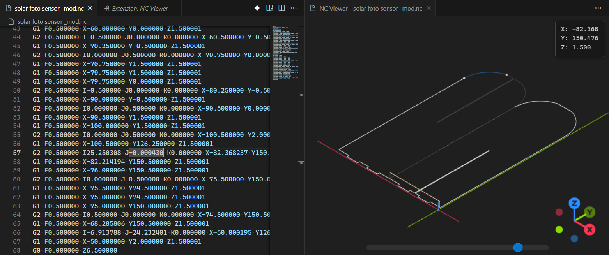

# NC Viewer

A Visual Studio Code extension for viewing NC/G-code files with interactive 3D visualization.

## Features

- 📱 **One-click viewing** - Right-click any `.nc` file and select "Open NC Viewer"
- 🎯 **Offline support** - Works without internet connection
- 🗂️ **No file upload needed** - Directly opens files from your workspace
- 🎨 **3D path visualization** - Interactive Three.js rendering of toolpaths
- 🌙 **Dark/Light themes** - Matches your VS Code theme
- 📊 **Real-time position tracking** - See current X/Y/Z coordinates

## Usage

1. Open any `.nc`, `.gcode`, or `.cnc` file in VS Code
2. Right-click in the editor or file explorer
3. Select "Open NC Viewer"
4. View your toolpath in 3D!

## Installation

Install from VS Code Marketplace or build from source.

## Credits

This extension is inspired by [NCviewer](https://github.com/NCalu/NCviewer) by NCalu.
Thanks for the excellent web-based G-code viewer that made this VS Code integration possible!

## License

MIT
